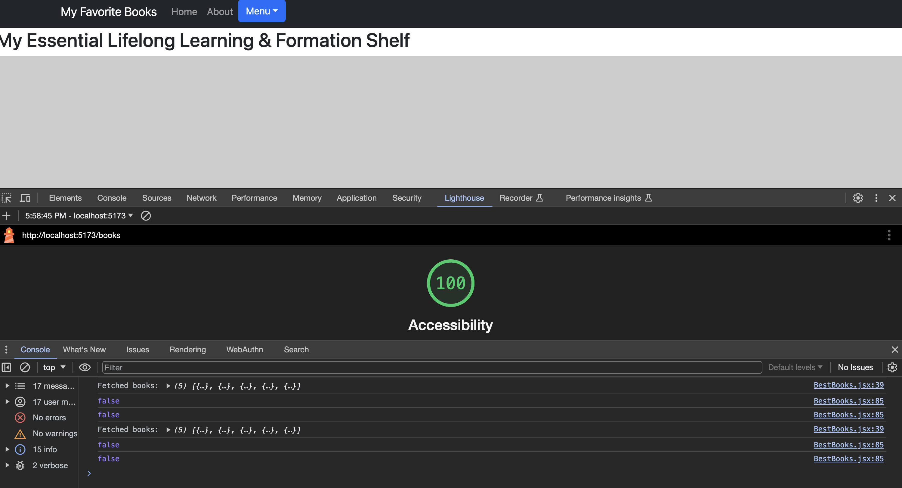
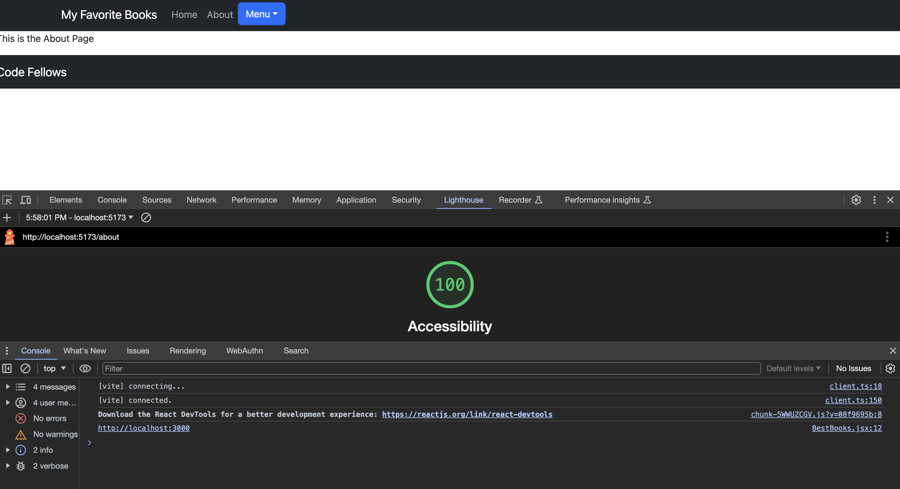
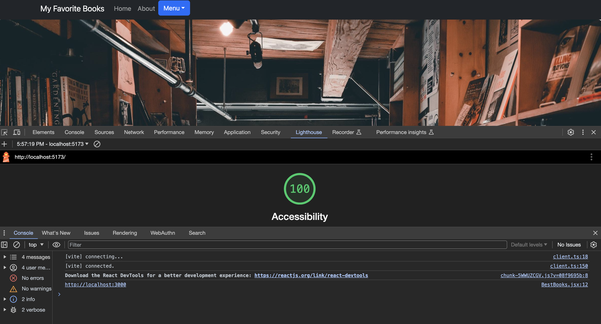

# Can of Books Lab 11-14

## Labs

**Author**: Xin Deng, Johnny Backus

### Lab 11 - Custom Servers with Node and Express

**Version**: 1.0.0 (Set up server and lightweight front end to retrieve and display books from a Mongo Database)

### Lab 12 - Resource Create and Delete

**Version**: 1.0.1 (Added Create and Post abilities)

### Lab 13 - Update a Resource

**Version**: 1.0.2 (Added Update ability and applied some styling to page)

### Lab 14 - TBD

**Version**: 1.0.3 (TBD - plan to add password authentication)

## Overview

This site is the result of a collaborative student project by CodeFellows Coding Program out of Seattle, WA.The purpose is to demonstrate the ability to work in pairs and quickly deploy a full stack app. The front-end utilized a React Framework with Bootstrap Components. The server was built with NodeJS and our database was MongoDB. Other dependencies included express, axios, cors, dotenv, and mongoose.

For this application books were used as our sample resource. REST principles allow the visitor to access and manipulate book data through four methods - Create, Read, Update, and Delete also known as CRUD. The user can add a book to the database, view all books in the database, update a book in the database, and delete a book from the database. The user can also view a list of books that they have added to the database.

## Getting Started

## Architecture

REST Architecture implementing CRUD principles. Tools used include REACT, JavaScript, APIs, Axios, MONGODB, Express, Axios, Cors, BootStrap , and Mongoose.

## Change Log

See version log

## Credit and Collaborations

**Monday:**
[Johns In Class Demo Lab 11](https://github.com/codefellows/seattle-code-301d110/tree/main/class-11/demo)
ChatGPT/Tammy, John, Brandon

**Tuesday:**
[Johns In Class Demo Lab 12](https://github.com/codefellows/seattle-code-301d110/blob/main/class-12/demo/back-end/server.js)
ChatGPT: (https://chat.openai.com/share/5e83ccaa-f50d-4505-b49e-149e9bddfe53)
TA's: Brandon, Ike

**Wednesday:**
[Johns In Class Demo Lab 13](https://github.com/codefellows/seattle-code-301d110/tree/main/class-13/demo)
ChatGPT:
TA's: Brandon - much help received with verifiying connection of a new server and troubleshooting issues with displaying modals.

**Friday:**

## Time Estimates

### Lab 11

1. Number and name of feature: Feature #1: Set up your repositories

   - Estimate of time needed to complete: 1 hrs
   - Start time: 1:40pm
   - Finish time: 2:30pm
   - Actual time needed to complete: 1 hr

1. Number and name of feature: Feature #2: Storage: As a user, I'd like to view the list of books, so that whenever I visit the page, I can see the a full list of best books.

   - Estimate of time needed to complete: 4 hrs
   - Start time: 2:30pm
   - Finish time: NA
   - Actual time needed to complete: 8 hrs and still not done

1. Number and name of feature: Feature 3: Book Component: As a user, I'd like to see the list of books, so that I can see what's recommended to me.
   - Estimate of time needed to complete: 3 hrs
   - Start time: NA
   - Finish time: NA
   - Actual time needed to complete: NA

### Lab 12

1. Number and name of feature: Feature #1: Create: As a user, I'd like to add a new book to the shelf, so that I can update the list with my own recommendations.

   - Estimate of time needed to complete: 3 hrs
   - Start time: 2:30pm
   - Finish time: 9:00pm
   - Actual time needed to complete: 7 hr 30 min

1. Number and name of feature: Feature #2: Delete: As a user, I want to remove books from my list, so that only the most important books are on my shelf.
   - Estimate of time needed to complete: 3 hrs
   - Start time: 9:00pm
   - Finish time: NA
   - Actual time needed to complete: 9 hrs and still not done

### Lab 13

1. Number and name of feature: Feature #1: Update: As a user, I want to update book details on my list, so that I can change the book status, or update the book details as I learn more about it.
   - Estimate of time needed to complete: 3 hrs
   - Start time: 1:00pm
   - Finish time: 6:00pm
   - Actual time needed to complete: 5 hr

### Lab 14

1. Number and name of feature: Feature #1: Authentication: As a user, I'd like to sign in with OAuth, so that I can authenticate to the site without creating yet-another username/password combo to potentially get hacked or lost.
   - Estimate of time needed to complete: 3 hrs
   - Start time:
   - Finish time:
   - Actual time needed to complete:

## Lighthouse Accessibility Report Score

## Logistical

1. What hours will you be available to communicate?
   - 9am-6pm(possibly later) PST
2. What platform will you use to communicate (ie. Slack, phone …)?
   - Slack
3. How often will you take breaks?
   - As needed
4. What is your plan if you start to fall behind?
   - The team is in agreement if extra hours are needed we will commit more time and not be afraid of asking for help.

## Cooperative

1. Make a list of each parson’s strengths.
   - Johnny: Equally bad at all aspects of coding, but reasonably good at breaking down complex tasks into smaller functions.
   - Xin: Turns in things, also equally bad at coding here, can help with syntax check
2. How can you best utilize these strengths in the development of your application?
   - To optimize the team's performance in the project, Johnny's general coding skills can be used for tasks that require basic coding knowledge and Xin's reliability in meeting deadlines should be utilized for maintaining project timelines.
3. In what areas do you each want to develop greater strength?
   - Johnny: Collaboration
   - Xin: The Teamwork Competency: Collaboration
4. Knowing that every person in your team needs to understand the code, how do you plan to approach the day-to-day development?
   - Clear Project Overview
     - Document the project
     - Regular team meetings
   - Collaborative Tools and Documentation
     - Use Project management tools (Trello)
   - Task Distribution
     - Define roles and responsibilities
     - Encourage Questions and Discussions
     - Open communication on slack
     - Constructive Feedback

## Conflict Resolution

1. What will your team do if one person is pulling all the weight while the other person is not contributing?
   - Open Communication: We will encourage open and honest communication within the team. Team members should feel comfortable expressing their concerns, ideas, and disagreements.
   - Identify the Issue: When a conflict arises, we will work together to clearly identify the specific issue or disagreement. It's important to understand the root cause of the conflict.
   - Discussion and Resolution: The team will engage in a constructive discussion to find a solution. All team members will have the opportunity to share their perspectives, and we will seek a resolution that takes into account everyone's input
   - Consensus or Compromise: We will strive to reach a consensus whenever possible. If a consensus is not achievable, we will consider compromise, making sure all team members are comfortable with the solution.
   - Documentation: We will document the agreed-upon resolution and ensure that everyone understands their roles and responsibilities moving forward.
2. What will your team do if one person is taking over the project and not letting the other member contribute?
   - If one team member is taking over the project and not allowing others to contribute, we will address this issue promptly.
   - The team will hold a discussion, reminding everyone of the importance of equal contributions and collaboration.
   - We will encourage the dominant member to listen actively to other team members' ideas and feedback.
   - If the issue persists, we will involve a TA or course instructor to mediate and ensure fair participation.
3. How will you approach each other and the challenge of building an application knowing that it is impossible for two people to be at the exact same place in understanding and skill level?
   - We understand that team members may have different levels of understanding and skill. We will approach this diversity as an opportunity for learning and growth.
   - We will promote a process by which more experienced members can assist those who may need additional support.
